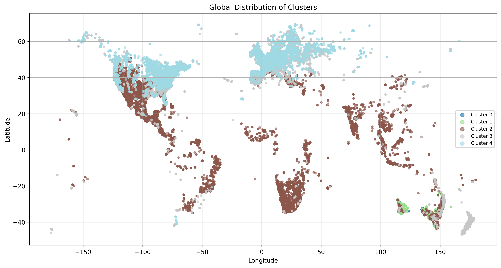

# AnimalSAT: Multimodal Classification of Cryptic Species

**4343MMEBX · Group 3** — Aart Rosmolen, Emma Bouwman, Emma van Eerde  
Leiden University · 2025–2026

---

## Overview

**AnimalSAT** investigates whether incorporating satellite-derived environmental context can improve classification of cryptic species: species that are morphologically similar but ecologically distinct.

We combine species images from the [CrypticBio dataset](https://huggingface.co/datasets/gmanolache/CrypticBio) (Manolache, Schouten, & Vanschoren, 2025) with Sentinel-2 satellite imagery retrieved at the observation location and date, and evaluate four multimodal fusion strategies: early, late, gated and transformer fusion. 

### Global Distribution of Clusters

*Global distribution of the five cryptic species clusters in the CrypticBio dataset. Cluster 2 (brown) was selected for experiments due to its geographic diversity and largest number of observations.*

## REPRODUCIBILITY STATEMENT

Within this project, one core concept that was kept in mind was the ability to reproduce results. Due to this, a lot of different tools were used to keep it as consistent as possible. Therefore, it was possible to construct the following code instructions.

1. Clone the repository at https://github.com/EmmaBouwman/CrypticBio

2. Initialize the database with sbatch `slurm/db_init.sh`.
At the time of writing, Manolache et al. (2025) have not indicated whether multiple versions of the CrypticBio dataset will be released. The dataset used in this work is therefore assumed to be version 1.

3. Generate cluster individuals based on dataset size with `sbatch slurm/data_analysis.sh`.

4. Download the images of the individuals from the cluster with `sbatch slurm/download_images.sh <path to csv> <column name>`.

Sometimes this runs into an issue due to HTTP errors or API rate limits. These IDs are captured in a text file.
Additionally, you will need to have a SHConfig file with the client id and client secret obtained from the Planet website.
Due to the money constraint and the api limit of 30000, it is not possible to share these secrets to verify these images.

5. (Optional) Perform resizing of the images to 224x224 with `sbatch slurm/resize_images.sh`.
This speeds up the training and testing significantly and is recommended for the method that is used for the transformations.

6. Initialize a new virtual environment to queue multiple slurm jobs for training and/or testing with `sbatch slurm/setup venv.sh`.

7. Train (and automatically test) one model with `sbatch slurm/<model_type>/<model_option>.sh`.
With this the model_type can be early_fusion, gated_fusion, late_fusion or transformer. In those folders, you can find the respective models that have a single bash file.

8. Test one model with sbatch `slurm/<model_type>/<model_option>.sh`, but add `–-test only` to the run command as argument.

9. Create plots showcasing the train and validation accuracy over the epochs with sbatch `slurm/create_plots.sh`.

10. (Optional, only for transformer models) view the raw attention value map that is mapped over satellite and/or specie images with sbatch `slurm/gradcam.sh`. Make sure you correctly set the parameters here to the model you wish to see the results from.

## Authors

| Name | Student ID |
|---|---|
| Aart Rosmolen | s2548526 |
| Emma Bouwman | s2832674 |
| Emma van Eerde | s2800020 |

## Reference
Manolache, G., Schouten, G., & Vanschoren, J. (2025). *CrypticBio: A large multimodal dataset for visually confusing biodiversity*. arXiv. https://arxiv.org/abs/2505.14707